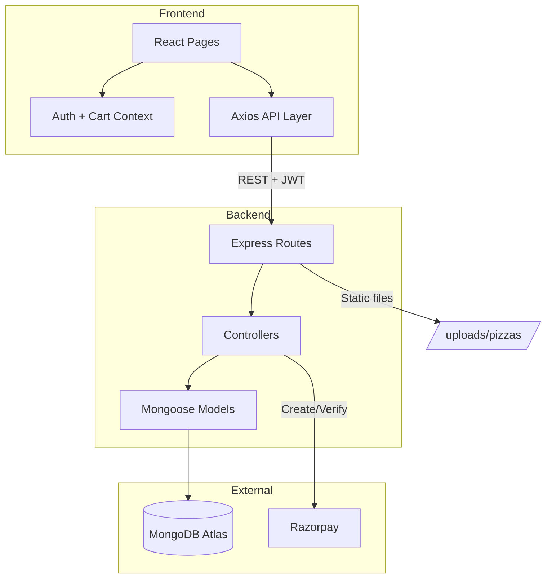

# Pizza Palace — Application Documentation

## 1. Overview

**Pizza Palace** is a full-stack online pizza ordering web application built with the **MERN stack**:

| Layer | Technology |
|--------|------------|
| **Frontend** | React 19, React Router 7, Tailwind CSS, Axios |
| **Backend** | Node.js, Express 5, MongoDB, Mongoose |
| **Auth** | JWT (JSON Web Tokens) |
| **Payments** | Razorpay (test mode) |
| **File uploads** | Multer (pizza images) |

Customers can browse the menu, add items to a cart, place orders, and pay online or with Cash on Delivery. Admins manage pizzas, orders, and availability from a dedicated dashboard.

---

## 2. Project Structure

```
pizza palace/
├── backend/                 # REST API server
│   ├── config/              # DB connection, constants
│   ├── controllers/         # Business logic (MVC)
│   ├── middleware/          # Auth, validation, uploads, errors
│   ├── models/              # MongoDB schemas (User, Pizza, Order)
│   ├── routes/              # API route definitions
│   ├── uploads/pizzas/      # Uploaded product images
│   ├── utils/               # Helpers (API responses, image cleanup)
│   ├── server.js            # App entry point
│   └── .env                 # Secrets & configuration
│
└── frontend/                # React single-page application
    ├── public/              # Static HTML shell
    └── src/
        ├── api/             # HTTP clients (axios)
        ├── assets/          # Logo, hero image, fallbacks
        ├── components/      # Reusable UI (Navbar, PizzaCard, etc.)
        ├── config/          # API base URL
        ├── context/         # Global state (Auth, Cart)
        ├── pages/           # Route-level screens
        └── utils/           # Image URL helper
```

Architecture follows **MVC on the backend** and **component-based routing on the frontend**, with clear separation between API, state, and UI.

---

## 3. Backend — Source Code & Features

### 3.1 Entry Point (`server.js`)

- Loads environment variables (`.env`)
- Connects to MongoDB via `config/db.js`
- Enables CORS, JSON parsing, request logging (`morgan`)
- Serves uploaded images at `/uploads`
- Mounts API routes under `/api/*`
- Global **404** and **error** handlers

Default port: **5000**

### 3.2 Database Models

| Model | Purpose | Main Fields |
|--------|---------|-------------|
| **User** | Customers & admins | `name`, `email`, `password` (hashed), `role` (`customer` / `admin`) |
| **Pizza** | Menu items | `name`, `description`, `category`, `sizes`, `prices` (per size), `image`, `isAvailable` |
| **Order** | Customer orders | `user`, `orderItems[]`, `totalAmount`, `deliveryAddress`, `paymentMethod`, `orderStatus`, `isPaid` |

**Order status flow:**  
`Pending` → `Preparing` → `Out for Delivery` → `Delivered` (or `Cancelled`)

Passwords are hashed with **bcrypt** before save. Order totals are calculated on the server from live pizza prices.

### 3.3 API Endpoints

#### Authentication (`/api/auth`)

| Method | Endpoint | Access | Description |
|--------|----------|--------|-------------|
| POST | `/register` | Public | Create account (default role: customer) |
| POST | `/login` | Public | Login; returns JWT + user |
| GET | `/profile` | Private | Get logged-in user |

#### Pizzas (`/api/pizzas`)

| Method | Endpoint | Access | Description |
|--------|----------|--------|-------------|
| GET | `/` | Public | List pizzas (pagination, search, category, sort) |
| GET | `/:id` | Public | Single pizza details |
| POST | `/` | Admin | Create pizza (multipart: image file + JSON fields) |
| PUT | `/:id` | Admin | Update pizza (optional new image) |
| DELETE | `/:id` | Admin | Delete pizza + uploaded image file |

#### Orders (`/api/orders`)

| Method | Endpoint | Access | Description |
|--------|----------|--------|-------------|
| POST | `/` | Customer | Place order |
| GET | `/my` | Customer | Own order history |
| GET | `/:id` | Owner / Admin | Order details |
| GET | `/` | Admin | All orders (filters) |
| PUT | `/:id/status` | Admin | Update status |
| DELETE | `/:id` | Admin | Delete order |

#### Payments (`/api/payments`)

| Method | Endpoint | Access | Description |
|--------|----------|--------|-------------|
| POST | `/order` | Customer | Create Razorpay order for an existing app order |
| POST | `/verify` | Customer | Verify payment signature; mark order paid |

### 3.4 Middleware

| Middleware | Role |
|------------|------|
| `authMiddleware` | Validates JWT; attaches `req.user` |
| `adminMiddleware` | Ensures `role === 'admin'` |
| `validators` + `handleValidation` | Input validation (`express-validator`) |
| `uploadMiddleware` | Multer — saves images to `uploads/pizzas/` |
| `parsePizzaForm` | Parses JSON strings from multipart form (`sizes`, `prices`) |
| `errorMiddleware` | Centralized error responses |

### 3.5 Backend Features (Summary)

- JWT authentication with role-based access
- CRUD for pizzas with **image upload** (JPG, PNG, WEBP, GIF, max 5MB)
- Server-side price calculation for orders
- Razorpay integration (create order + verify signature)
- Pagination, search, and filters on pizza listing
- Consistent JSON responses: `{ success, message, data }`
- MongoDB Atlas (cloud) or local MongoDB via `MONGO_URI`

### 3.6 Environment Variables (Backend)

```
MONGO_URI, PORT, JWT_SECRET, JWT_EXPIRES_IN, NODE_ENV, KEY_ID, KEY_SECRET
```

(`KEY_ID` / `KEY_SECRET` = Razorpay test/live keys)

---

## 4. Frontend — Source Code & Features

### 4.1 Tech Stack

- **Create React App** (`react-scripts`)
- **Tailwind CSS** for styling
- **React Router** for navigation
- **Axios** for API calls
- **react-hot-toast** for notifications
- **Context API** for auth and cart (no Redux)

### 4.2 Application Flow (`App.js`)

```
AuthProvider
  └── CartProvider
        └── Navbar + Routes + Footer + Toaster
```

Routes are split into **public**, **customer (protected)**, and **admin**.

### 4.3 Routing & Pages

| Route | Page | Access | Features |
|-------|------|--------|----------|
| `/` | **Home** | Public | Hero, search bar, featured pizzas |
| `/menu` | **Menu** | Public | Full catalogue, filters, sort, search |
| `/pizza/:id` | **PizzaDetail** | Public | Sizes, quantity, add to cart |
| `/login` | **Login** | Public | Email/password login |
| `/signup` | **Signup** | Public | Registration |
| `/cart` | **Cart** | Logged in | View/edit items, subtotal |
| `/checkout` | **Checkout** | Logged in | Address, payment method, place order |
| `/orders` | **OrderHistory** | Logged in | Past orders & status |
| `/admin` | **AdminDashboard** | Admin | Overview stats |
| `/admin/pizzas` | **AdminPizzas** | Admin | CRUD pizzas, image upload, stock toggle |
| `/admin/orders` | **AdminOrders** | Admin | View/update/delete orders |

**Guards:**

- `ProtectedRoute` — redirects to `/login` if not authenticated
- `AdminRoute` — redirects if user is not admin

### 4.4 Global State (Context)

#### AuthContext

- Stores `user`, `token`, `loading`
- Persists login in `localStorage`
- Verifies token on app load via `/api/auth/profile`
- Exposes `login`, `register`, `logout`, `isAdmin`, `isAuthenticated`

#### CartContext

- Cart stored in `localStorage` (survives refresh)
- `addToCart`, `removeFromCart`, `updateQuantity`, `clearCart`
- `getPizzaPrice`, `cartTotal` for pricing

### 4.5 API Layer (`src/api/`)

| File | Purpose |
|------|---------|
| `axios.js` | Base client, attaches JWT, handles `FormData` |
| `authApi.js` | Register, login, profile |
| `pizzaApi.js` | Pizza CRUD & listing |
| `orderApi.js` | Place order, history, admin order management |
| `paymentApi.js` | Razorpay create + verify |

Base URL: `REACT_APP_API_URL` (production: `https://pizzapalace-5xa5.onrender.com`, local fallback: `http://localhost:5000`)

### 4.6 Key Components

| Component | Purpose |
|-----------|---------|
| **Navbar** | Logo, links, cart badge, admin menu, mobile menu |
| **Footer** | Quick links, hours, contact |
| **PizzaCard** | Pizza preview on Home/Menu |
| **Spinner** | Loading indicator |
| **AdminPizzas modal** | Create/edit pizza with file upload (portal overlay) |

### 4.7 Frontend Features (Summary)

- Responsive UI (mobile + desktop)
- Search from home → menu with query param
- Category / availability filters and sorting on menu
- Cart persistence in browser
- Checkout with delivery address validation (10-digit phone)
- Payment options: **COD**, **UPI**, **Credit/Debit Card**, **Net Banking**
- Razorpay popup for online payments (test keys)
- Uploaded pizza images shown via `getPizzaImageUrl()` helper
- Toast feedback for success/errors
- Admin: toggle in-stock, edit/delete pizzas, update order status

### 4.8 Environment Variables (Frontend)

```
REACT_APP_API_URL=https://pizzapalace-5xa5.onrender.com
REACT_APP_RAZORPAY_KEY=rzp_test_...
```

For local backend development only, use `http://localhost:5000` instead (e.g. in `.env.development.local`).

---

## 5. End-to-End User Flows

### Customer Flow

1. Browse **Home** or **Menu**
2. Open pizza → choose size & quantity → **Add to cart**
3. **Cart** → adjust quantities
4. **Checkout** → enter address → choose payment
5. **COD:** order saved immediately
6. **Online:** Razorpay opens → pay → server verifies → order marked **Preparing** & **paid**
7. View orders on **Order History**

### Admin Flow

1. Log in with admin account
2. **Admin Dashboard** — overview
3. **Manage Pizzas** — add/edit/delete, upload image, toggle availability
4. **Manage Orders** — view all orders, change status, delete if needed

---

## 6. Security Features

- Passwords hashed (bcrypt, salt rounds 12)
- JWT on protected routes; token sent as `Authorization: Bearer <token>`
- Admin-only routes on backend and frontend
- Input validation on all major endpoints
- Payment verification via Razorpay HMAC signature
- Secrets in `.env` (not in source code)

---

## 7. How to Run the Application

**Backend:**

```bash
cd backend
npm install
npm run dev
```

**Frontend:**

```bash
cd frontend
npm install
npm start
```

- Frontend: http://localhost:3000
- Backend API (local): http://localhost:5000
- Backend API (production): https://pizzapalace-5xa5.onrender.com

---

## 8. Deployment

| Service | URL |
|---------|-----|
| **Backend (Render)** | https://pizzapalace-5xa5.onrender.com |
| **API base** | `REACT_APP_API_URL` → requests go to `/api/*` |
| **Health check** | https://pizzapalace-5xa5.onrender.com/ |

**Render:** Set `CLIENT_URL` to your Vercel frontend URL (e.g. `https://your-app.vercel.app`) so CORS allows the browser to call the API.

**Vercel:** Set `REACT_APP_API_URL=https://pizzapalace-5xa5.onrender.com` and `REACT_APP_RAZORPAY_KEY` in project environment variables, then redeploy.

---

## 9. Data Flow Diagram



---

## 9. Summary

**Pizza Palace** is a complete food-ordering platform: customers get a modern browsing and checkout experience; admins manage the catalogue and fulfillment; the backend enforces security, validation, and payment verification. The codebase is organized for clarity (MVC backend, routed pages and contexts on frontend) and is suitable for demonstration, coursework, or further production hardening (HTTPS, live Razorpay keys, deployment).

---

*Document generated for Pizza Palace — Full Stack Web Development Project*
